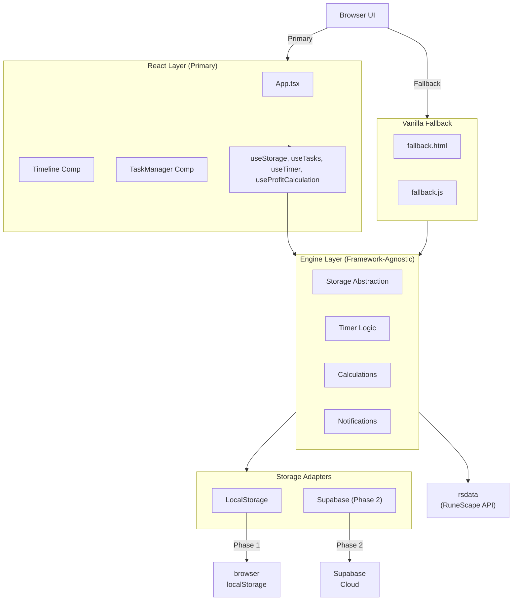

# 📋 Dailyscape React Modernization – Brainstorming Specification

**Date:** 2026-04-14  
**Project:** Dailyscape React Rebuild  
**Status:** SPECIFICATION APPROVED ✅

---

## 1. Project Vision & Goals

### 1.1 Objective
Rebuild **Dailyscape** from vanilla JavaScript to a modular **React + TypeScript** architecture while:
- Preserving 100% of existing features and user experience
- Maintaining backwards compatibility via vanilla JS fallback
- Enabling Phase 2 cloud sync (Supabase) via storage abstraction
- Supporting Discord bot integration via skeleton hooks
- Implementing comprehensive unit + integration test coverage

### 1.2 Current State
- **Existing:** Static HTML/CSS/JS site on GitHub Pages
- **Tech:** Bootstrap 5, vanilla JS (~1800 lines), localStorage
- **Users:** RuneScape 3 players tracking daily/weekly/monthly tasks
- **Features:** Multi-profile, drag-drop reordering, profit calculations, item tooltips, 5 task categories

---

## 2. Architecture & Scope

### 2.1 Dual-Track Build Strategy

```
Dailyscape/
├─ src/engine/              # Pure logic (framework-agnostic)
├─ src/react/               # React UI (primary)
├─ src/vanilla/             # Vanilla JS fallback (modernized)
├─ src/data/                # Static configs
├─ tests/                   # Full coverage
└─ public/                  # Static assets + rsdata
```

**Key Principle:** Engine logic is **completely decoupled** from UI. Both React and vanilla JS consume it via same interfaces.

### 2.2 Engine Layer Responsibilities

The **engine/** folder contains pure TypeScript logic (no React dependencies):
- **storage/** - Abstraction layer (localStorage adapter + Supabase placeholder)
- **timer/** - Reset time calculations & countdown logic
- **notifications/** - Web Notifications API wrapper + Discord skeleton
- **calculations/** - Profit/XP calculations using rsdata
- **schema/** - TypeScript interfaces & validation

### 2.3 Data Model (Verified from Existing Code)

**Storage Structure:**
```
profilePrefix = currentProfile === 'default' ? '' : `${currentProfile}-`;

// Task state ('true' = completed, 'false' = pending, 'hide' = hidden)
storage[`${profilePrefix}${taskSlug}`] = 'true' | 'false' | 'hide';

// Profile system
storage['profiles'] = 'default,alt1,alt2';
storage['current-profile'] = 'default';

// Layout & sorting
storage[`${profilePrefix}section-layout-daily-${mode}-weekly-${mode}`] = JSON;
storage[`${profilePrefix}${timeframe}-order`] = 'alpha' | 'asc' | 'desc';

// Settings
storage[`${profilePrefix}split-daily-tables`] = 'true' | 'false';
storage['current-layout`] = 'compact' | undefined;

// Timestamps
storage[`${profilePrefix}${timeframe}-updated`] = timestamp;
```

**5 Timeframes:**
- `rs3daily` - Daily tasks
- `rs3dailyshops` - Daily gathering activities
- `rs3weekly` - Weekly tasks
- `rs3weeklyshops` - Weekly gathering activities
- `rs3monthly` - Monthly tasks

**Reset Times (UTC):**
- Daily: 00:00 every day
- Weekly: 00:00 Wednesday
- Monthly: 00:00 on 1st of month

---

## 3. Feature Parity Matrix

| Feature | Current | React | Vanilla Fallback | Status |
|---------|---------|-------|------------------|--------|
| Multi-profile system | ✅ | ✅ | ✅ | Baseline |
| Task completion tracking | ✅ | ✅ | ✅ | Baseline |
| Drag-drop reordering (saved) | ✅ | ✅ | ✅ | Baseline |
| Sort by name/profit/default | ✅ | ✅ | ✅ | Baseline |
| Compact vs. full layout | ✅ | ✅ | ✅ | Baseline |
| Hide/show sections | ✅ | ✅ | ✅ | Baseline |
| Profit calculations (GE items) | ✅ | ✅ | ✅ | Baseline |
| Item tooltips (rsdata) | ✅ | ✅ | ✅ | Baseline |
| Split/combined table modes | ✅ | ✅ | ✅ | Baseline |
| Automatic resets (timer logic) | ✅ | ✅ | ✅ | Baseline |
| Countdown timers per category | ✅ | ✅ | ✅ | Baseline |
| Import/export tokens (JSON) | ✅ | ✅ | ✅ | Baseline |
| Web Notifications API | ❌ | ✅ | ❌ | NEW |
| Discord bot skeleton | ❌ | ✅ | ✅ | NEW (hooks only) |
| Storage abstraction (Phase 2 ready) | ❌ | ✅ | ✅ | NEW |

---

## 4. Implementation Scope

### 4.1 Phase 1: React Primary (Weeks 1-2)

**Deliverables:**
- [ ] Project structure scaffolded
- [ ] Engine logic (TypeScript) implemented & tested
- [ ] React components built & connected
- [ ] Tests passing (unit + integration)
- [ ] Deployed to GitHub Pages (React version)
- [ ] Vanilla fallback working (legacy support)

**Out of Scope (Phase 2+):**
- Supabase integration (storage adapter placeholder only)
- Discord bot implementation (skeleton hooks only)
- Advanced analytics/monitoring

### 4.2 Phase 2: Cloud Sync (Future)

- Supabase adapter implementation
- Multi-device sync
- User authentication

### 4.3 Phase 3: Discord Integration (Future)

- Attach user's existing Discord bot
- Notification delivery
- User management

---

## 5. Technical Decisions

### 5.1 Storage Architecture
- **Phase 1:** localStorage only, via adapter pattern
- **Adapter Interface:** Storage.get/set/remove/clear/keys
- **Implementations:** 
  - `LocalStorageAdapter` (production)
  - `SupabaseAdapter` (placeholder, Phase 2)
  - `MemoryAdapter` (testing)

### 5.2 React Patterns
- **State Management:** React Context (ProfileContext, TaskContext, NotificationContext)
- **Data Fetching:** Custom hooks (useStorage, useTasks, useTimer, useProfitCalculation)
- **Styling:** Tailwind CSS (replacing Bootstrap for modernity)
- **Testing:** Jest + React Testing Library

### 5.3 Vanilla Fallback
- Modernized copy of existing code (cleaner structure, same feature set)
- Separate HTML entry point (`fallback.html`)
- Uses engine logic (not duplicating calculations)
- No React dependency

### 5.4 rsdata Dependency
- Keep existing architecture (rsdata files copied at build time)
- Optional: fetch on-demand via HTTP (Phase 2+ improvement)
- Item IDs and pricing embedded in component data

---

## 6. File Surface Map

### Create:
```
src/engine/storage/interface.ts
src/engine/storage/adapters/localStorage.ts
src/engine/storage/adapters/supabase.ts
src/engine/storage/index.ts

src/engine/timer/reset.ts
src/engine/timer/countdown.ts
src/engine/timer/index.ts

src/engine/notifications/web.ts
src/engine/notifications/discord.ts
src/engine/notifications/index.ts

src/engine/calculations/profit.ts
src/engine/calculations/index.ts

src/engine/schema/index.ts
src/engine/index.ts

src/react/App.tsx
src/react/components/Timeline/Timeline.tsx
src/react/components/Timeline/TimelineItem.tsx
src/react/components/TaskManager/TaskManager.tsx
src/react/components/TaskManager/TaskForm.tsx
src/react/components/HerbTimer/HerbTimer.tsx
src/react/components/Settings/Settings.tsx
src/react/components/Settings/ProfileManager.tsx
src/react/components/Common/Nav.tsx
src/react/context/TaskContext.tsx
src/react/context/ProfileContext.tsx
src/react/context/NotificationContext.tsx
src/react/hooks/useStorage.ts
src/react/hooks/useTasks.ts
src/react/hooks/useTimer.ts
src/react/hooks/useProfitCalculation.ts
src/react/index.tsx

src/vanilla/dailyscape-fallback.js
src/vanilla/dailyscape-fallback.css

tests/engine/storage.test.ts
tests/engine/timer.test.ts
tests/engine/notifications.test.ts
tests/engine/calculations.test.ts
tests/react/Timeline.test.tsx
tests/react/TaskManager.test.tsx
tests/react/Settings.test.tsx
tests/integration/sync.test.ts
tests/integration/e2e.test.ts

public/index.html
public/fallback.html
```

### Modify:
```
package.json (add React, TypeScript, Tailwind, Jest dependencies)
README.md (explain new structure & deployment)
```

### Remove (existing vanilla code):
```
dailyscape.js
dailyscape.css
index.html (→ public/index.html)
```

---

## 7. Testing Strategy

### 7.1 Unit Tests (engine/)
- Timer calculations (reset times, countdown logic)
- Storage adapters (get/set/clear operations)
- Profit calculations (GE item pricing)
- Notification dispatch

### 7.2 Integration Tests
- Storage ↔ Supabase sync (when Phase 2 ready)
- Web notifications + browser API
- Profile switching & data isolation
- Multiple tasks in sequence

### 7.3 React Component Tests
- Timeline rendering & click handlers
- Task completion state changes
- Sort/filter operations
- Profile context updates

### 7.4 E2E Tests
- Full user workflows (complete task → auto-reset → countdown)
- Drag-drop save/restore
- Import/export cycle

---

## 8. Deployment Strategy

### 8.1 GitHub Pages (Primary)
- **Directory:** `public/` root
- **Entrypoint:** `public/index.html` (React)
- **Build:** `npm run build` outputs to `dist/`
- **Fallback:** Serve `public/fallback.html` if React fails (using service worker)

### 8.2 Backwards Compatibility
- Vanilla fallback detects React failures
- Service worker redirects to `fallback.html`
- Same feature set, no data loss

---

## 9. Non-Functional Requirements

✅ **Zero Breaking Changes** - Existing users' localStorage untouched  
✅ **Fast Load Time** - <2s initial load (critical for browser tabs)  
✅ **Offline Support** - localStorage works without network  
✅ **Mobile Friendly** - Responsive Tailwind design  
✅ **A11y** - WCAG 2.1 AA compliance (tooltips, keyboard nav)  
✅ **SEO** - Meta tags for social sharing (static snapshot)

---

## 10. Success Criteria

- ✅ All 20+ features from existing site working in React version
- ✅ 100% feature parity with existing vanilla JS
- ✅ Test coverage >85% (engine logic 100%, React 75%+)
- ✅ Vanilla fallback deployable & functional
- ✅ No localStorage data loss for existing users
- ✅ Deployment to GitHub Pages successful
- ✅ Discord skeleton hooks ready for Phase 1.5
- ✅ Storage abstraction documented & ready for Supabase (Phase 2)

---

## 11. Architecture Diagram



---

## 12. Risk Mitigation

| Risk | Likelihood | Impact | Mitigation |
|------|-----------|--------|-----------|
| Breaking existing localStorage | High | High | Maintain key format, versioning in storage schema |
| rsdata dependency breaks | Medium | High | Pin versions, provide static snapshot fallback |
| Performance regression | Medium | Medium | React code-splitting, lazy load components |
| Browser compatibility (older users) | Medium | Medium | Vanilla fallback + service worker detection |
| Notification spam | Low | Medium | User settings + opt-in for web notifications |

---

**SPECIFICATION APPROVED** ✅

Next phase: **Implementation Plan** (execute-plans skill).

