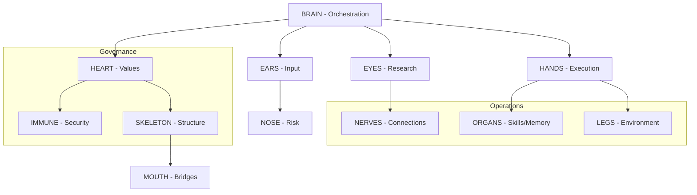

# 🗺️ Anatomical Map

```mermaid
graph TD
    BRAIN[BRAIN - Orchestration] --> HEART[HEART - Values]
    BRAIN --> EYES[EYES - Research]
    BRAIN --> EARS[EARS - Input]
    BRAIN --> HANDS[HANDS - Execution]
    
    EYES --> NERVES[NERVES - Connections]
    EARS --> NOSE[NOSE - Risk]
    
    HANDS --> ORGANS[ORGANS - Skills/Memory]
    HANDS --> LEGS[LEGS - Environment]
    
    HEART --> IMMUNE[IMMUNE - Security]
    HEART --> SKELETON[SKELETON - Structure]
    
    SKELETON --> MOUTH[MOUTH - Bridges]
    
    subgraph Operations
        ORGANS
        LEGS
        NERVES
    end
    
    subgraph Governance
        HEART
        IMMUNE
        SKELETON
    end
```

---
*Refer to BODY/SKELETON/STRUCTURE/BODY_MAP.md for directory mapping.*
