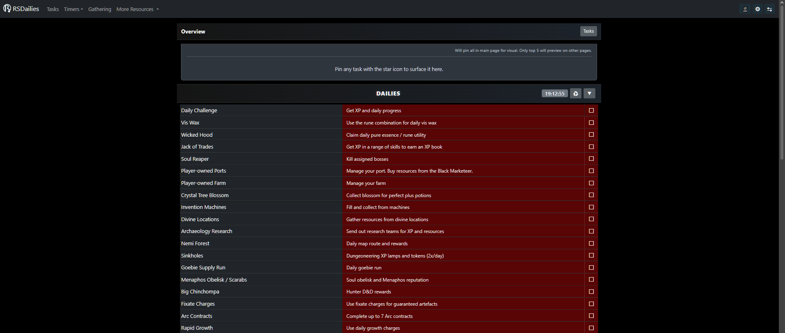

# 🌌 Dailyscape: The Definitive RuneScape Task Ecosystem

**Dailyscape** is a premium, configuration-first task management ecosystem for RuneScape players. Engineered for architectural purity and visual excellence, it transforms the concept of a "tracker" into a dynamic, content-driven runtime engine.

## 🌟 The Vision: Content is Logic
Most trackers are built as static lists. Dailyscape is built as a **Runtime Engine**. 

In Dailyscape, the code doesn't know what a "Daily Task" is until it reads the configuration files. This decoupling allows the framework to scale infinitely. Adding a new game mode, a new set of tasks, or a complex timer cluster is a matter of authoring structured data—the framework handles the rendering, state management, and reset orchestration automatically.

---

## 📑 Table of Contents
1. [Architectural Anatomy — The 7-Layer Framework](#️-architectural-anatomy--the-7-layer-framework)
2. [Organ-by-Organ Deep Dive](#-organ-by-organ-deep-dive)
3. [The Core Engine Mechanics](#-the-core-engine-mechanics)
   - [Data-to-DOM Pipeline](#data-to-dom-pipeline)
   - [Precision Reset Orchestration](#precision-reset-orchestration)
4. [Feature Ecosystem](#-feature-ecosystem)
   - [Precision Farming Timers](#️-precision-farming-timers)
   - [Adaptive Section Engine](#-adaptive-section-engine)
   - [Custom Task Framework](#-custom-task-framework)
   - [Multi-Profile Isolation](#-multi-profile-isolation)
5. [Design System & Aesthetics](#-design-system--aesthetics)
6. [Developer's Guide](#️-developers-guide)
   - [Quality Gate & Verification](#quality-gate--verification)
   - [Adding New Content](#adding-new-content)
7. [Legal & Credits](#️-legal--credits)

---

## 🏛️ Architectural Anatomy — The 7-Layer Framework

Dailyscape is structured into 7 distinct "organs". This modularity ensures that a change in the UI doesn't leak into the business logic, and adding a new task doesn't require touching the rendering engine.

| Layer | Responsibility | Canonical Location |
| :--- | :--- | :--- |
| **App** | Orchestration, Boot, Routing, and Wiring | `src/app/` |
| **Content** | Single Source of Truth (SSoT) for all Game Data | `src/content/` |
| **Domain** | Business Rules, Content Resolution, and Validation | `src/domain/` |
| **Features** | Vertical Slices of isolated behavior (e.g., Settings, Profiles) | `src/features/` |
| **Shared** | Cross-cutting infrastructure (Storage, Time, Math, DOM) | `src/shared/` |
| **Theme** | Token-driven CSS architecture (No JS logic) | `src/theme/` |
| **Widgets** | Self-contained UI components and specialized renderers | `src/widgets/` |

### The "Clean Flow" Import Rule
To prevent "spaghetti code", Dailyscape enforces a strict import hierarchy:
**Content → Domain → Features → App**

The **Shared** layer is a foundation for everyone. The **Theme** layer is isolated in CSS. **Widgets** receive their logic via dependency injection from the **App** layer.

---

## 🖼️ Visual Architecture

To understand the Dailyscape ecosystem, one must look at the structural hierarchy that governs the 7 organs.

### The Structural Layers
*The 7-organ topology ensures that logic, state, and presentation are completely decoupled.*

### Flow of Authority
*Data flows from the Content layer through the Domain and Features layers before reaching the UI.*

---

## 🫁 Organ-by-Organ Deep Dive

### 1. App (`src/app/`)
The "Brain". It manages the boot sequence (`bootstrap.js`), defines the layout structure, and coordinates the `render-orchestrator.js` which drives the visual state of the application.

### 2. Content (`src/content/`)
The "DNA". Contains zero logic—only pure data. Using factories like `defineTask` and `definePage`, developers author the entire tracker experience here. It is game-agnostic by design.

### 3. Domain (`src/domain/`)
The "Translator". It takes raw content and resolves it for the runtime. This includes merging user-created custom tasks, resolving penguin locations, and calculating complex timer offsets.

### 4. Features (`src/features/`)
The "Systems". Each feature (like the Reset Orchestrator or the View Controller) owns its specific state and rules. They are decoupled—the Profile feature doesn't know the Settings feature exists.

### 5. Shared (`src/shared/`)
The "Nervous System". Provides the essential utilities.
- **Storage Service**: Scoped, versioned access to `localStorage`.
- **Time Utilities**: Precise UTC reset boundary calculations.
- **Task State Machine**: Manages the transitions between `true`, `false`, `idle`, and `running`.

### 6. Theme (`src/theme/`)
The "Skin". A 100% tokenized design system. 
- **Tokens**: Centralized HSL colors, spacing, and geometry.
- **Components**: Pure CSS implementations of buttons, cards, and rows.

### 7. Widgets (`src/widgets/`)
The "Limbs". Specialized UI components. The **Section Engine** is the most powerful widget—it can render everything from a simple daily list to a complex, multi-stage farming timer cluster based purely on the `renderVariant` provided by the content layer.

---

## 🔄 The Core Engine Mechanics

### Data-to-DOM Pipeline
Every row you see in Dailyscape follows this deterministic path:
1.  **Authoring**: A developer defines a task in `src/content/`.
2.  **Resolution**: The `content-loader.js` validates the schema and hydrates the task.
3.  **Registration**: The task is mapped to a section in the `unified-registry.js`.
4.  **Composition**: The `composition-root.js` injects the required behavior into the widget.
5.  **Rendering**: The **Row Factory** clones a template and populates it with the resolved data.

### Precision Reset Orchestration
Dailyscape doesn't just clear tasks; it understands **Time**.
- **UTC-Aware**: All resets follow the in-game RuneScape clock (00:00 UTC).
- **Graceful Catch-up**: If you open the app 3 days late, the system detects the missed resets and clears your dailies and weeklies accordingly.
- **Micro-Updates**: Timers run on a high-frequency loop, ensuring zero-latency countdowns.

---

## ✨ Feature Ecosystem


### ⏱️ Precision Farming Timers
The farming system is a high-performance engine.
- **Speedy Growth Support**: Automatically adjusts math for all growth modifiers.
- **Real-time Synchronization**: Timers stay accurate across browser sessions.
- **Location Awareness**: Grouped by patch type (Herbs, Trees, Fruit Trees) for efficient gameplay.

### 📑 Adaptive Section Engine
The framework's UI adapts to the data.
- **Grouped Sections**: Supports sub-headers that "attach" to rows for zero-gap layouts.
- **Terminal Rounding**: Automatically calculates the last visible row to apply consistent border radii.
- **Hide-on-Complete**: Intelligent layout logic that hides finished tasks to reduce cognitive load.

### 👤 Custom Task Framework
Players can extend the authored content with their own tasks.
- **Persistent Persistence**: Custom tasks behave exactly like authored tasks.
- **Overview Integration**: Pin your most important custom tasks to the main dashboard.

### 🧑‍💼 Multi-Profile Isolation
Manage multiple RuneScape accounts with ease.
- **Complete Separation**: Each profile has its own completion state and settings.
- **Export/Import**: Move your entire setup between devices with a single JSON payload.

---

## 🎨 Design System & Aesthetics
Dailyscape is designed to be **visually stunning**. 
- **Dark-First Design**: Optimized for late-night gaming sessions.
- **Glassmorphism**: Subtle transparencies and blurs for a premium feel.
- **Dynamic Feedback**: Micro-animations for every checkbox, button, and timer reset.

---

## 🛠️ Developer's Guide

### Quality Gate & Verification
We maintain a strict "Prinstine" repository state. All changes must pass:
```bash
npm test            # 10/10 unit tests passing
npm run audit       # Full topology and content schema validation
npm run build       # Vite production build (0 errors)
```

### Adding New Content
1.  Define your task in the appropriate `src/content/games/` directory.
2.  Use the `defineTask` factory to ensure schema compliance.
3.  Add the task to a section definition.
4.  The framework handles the rest.

---

## ⚖️ Legal & Credits
- **RuneScape**: All game icons and assets are property of Jagex Ltd. Dailyscape is a fan project and is not affiliated with Jagex.
- **Icons**: Designed by the Dailyscape team or sourced from community assets.
- **Framework**: Engineered as a next-generation evolution of the original Dailyscape project.

---
*Built for players, by players. May your gains be eternal.*
