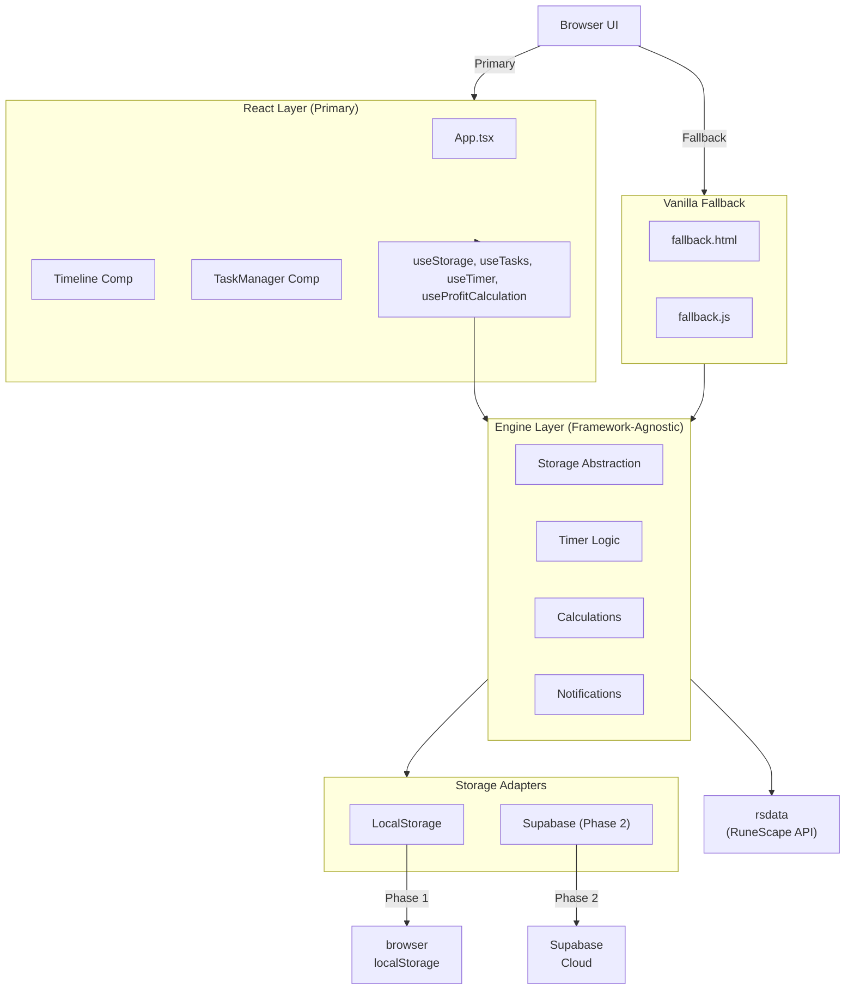

# Dailyscape - React Edition

[](https://github.com/Zahzr/RSDailies/actions/workflows/deploy.yml)

**Live Demo:** [https://zahzr.github.io/RSDailies/](https://zahzr.github.io/RSDailies/)

**Dailyscape** is a tool for RuneScape 3 players to track their daily, weekly, and monthly in-game tasks. This modernized version is built with React and TypeScript, offering a fast, reliable, and extensible experience.

## Architecture Overview

This project follows a **dual-track architecture** to ensure both a modern experience and maximum backwards compatibility.

-   **React Layer (Primary):** The main application is a modern Single Page Application (SPA) built with React, TypeScript, and Tailwind CSS. It provides a rich, interactive user experience.
-   **Vanilla JS Fallback:** A lightweight, modernized vanilla JavaScript version is included. A service worker will automatically serve this fallback version if a user's browser fails to load the React application, ensuring no user is left behind.
-   **Decoupled Engine:** All core business logic (timers, calculations, storage) is isolated in a framework-agnostic `engine` layer. This pure TypeScript module is consumed by both the React app and the vanilla fallback, ensuring consistency and preventing code duplication.

### Architecture Diagram



## Development Setup

To get started with development, clone the repository and install the dependencies.

1.  **Install Dependencies:**
    ```bash
    npm install
    ```

2.  **Run Development Server:**
    This will start the Vite dev server for the React application, usually on `http://localhost:5173`.
    ```bash
    npm run dev
    ```

3.  **Run Tests:**
    Execute the full test suite using Jest and React Testing Library.
    ```bash
    npm test
    ```

## Build & Deployment

The application is designed for deployment on static hosting services like GitHub Pages.

1.  **Build the Project:**
    This command bundles the React app, the vanilla fallback, and all assets into the `dist/` directory.
    ```bash
    npm run build
    ```

2.  **Deployment:**
    This project is automatically deployed to GitHub Pages via a GitHub Action. Pushing to the `main` branch will trigger a build and deployment. You can monitor the status of deployments under the "Actions" tab in the repository.

## Contributing

We welcome contributions! Here’s a quick guide on where to make changes:

-   **UI Components:** If you're changing how something looks or feels in the main app, look in `src/react/components/`.
-   **Core Logic:** For changes to timers, profit calculations, or how data is stored, head to `src/engine/`.
-   **State Management:** Global state and data flow are managed in React Context (`src/react/context/`) and custom hooks (`src/react/hooks/`).
-   **Fallback App:** To modify the non-React version, see `src/vanilla/`.

## Known Limitations

-   **Cloud Sync (Phase 2):** The current version only stores data in the browser's `localStorage`. The storage adapter for Supabase is a placeholder for future cloud sync functionality.
-   **Discord Notifications (Phase 1.5):** The hooks for Discord bot integration are in place within the notification engine, but the implementation is pending.

RuneScape ® is a registered trademark of Jagex © 1999 Jagex Ltd.
