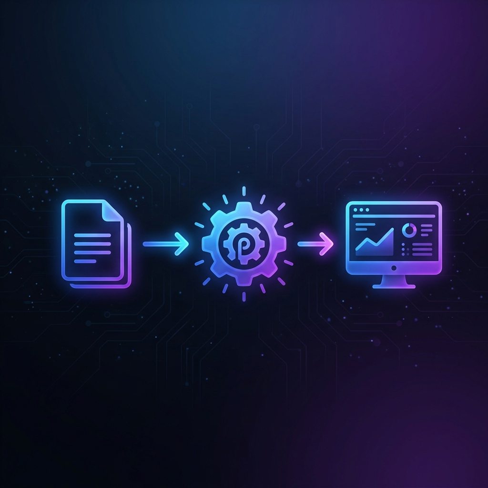

# 🌌 Dailyscape: The Definitive RuneScape Task Ecosystem

**Dailyscape** is a premium, configuration-first task management ecosystem for RuneScape players. Engineered for architectural purity and visual excellence, it transforms the concept of a "tracker" into a dynamic, content-driven runtime engine.

---

## 📑 Table of Contents

1. [Project Overview](#-project-overview)
2. [Architectural Anatomy (The Topology)](#-architectural-anatomy-the-topology)
3. [The Core Engine Mechanics](#-the-core-engine-mechanics)
4. [Technical Implementation Detail](#-technical-implementation-detail)
    * [Data Schemas](#data-schemas)
    * [State & Persistence](#state--persistence)
    * [Reset Orchestration](#reset-orchestration)
5. [Feature Deep-Dive](#-feature-deep-dive)
    * [Precision Timers](#precision-timers)
    * [Section Engine](#section-engine)
    * [Custom Tasks](#custom-tasks)
6. [Verification & Quality Assurance](#-verification--quality-assurance)
7. [Developer Guide](#-developer-guide)
8. [Legal & Credits](#-legal--credits)

---

## 🏛️ Project Overview

Dailyscape is built on the philosophy that **Content is Logic**. Unlike traditional trackers that hardcode UI elements, Dailyscape treats every task, section, and page as authored data.

### Core Concept: The Runtime Content Engine

The application acts as a "shell" that hydrates itself from a centralized repository of game data. This decoupling of **Content (The What)** from **Runtime (The How)** and **UI (The Look)** allows for:
* **Instant Scaling**: Adding a new game (like OSRS) is a matter of adding content files, not writing new UI logic.
* **SSoT (Single Source of Truth)**: A task's definition lives in one place and is propagated across the entire system.
* **Predictable Iteration**: AI agents and human developers can modify the tracker with zero risk of breaking the core orchestration.

---

## 🛰️ Architectural Anatomy (The Topology)


Dailyscape follows a strict anatomical topology. Each layer is isolated and has a singular responsibility.

### 📂 Detailed Directory Map

| Layer | Path | Responsibility | Canonical Owner |
| :--- | :--- | :--- | :--- |
| **The Brain** | `src/app/` | Orchestration, Registries, and Lifecycle. | `render-orchestrator.js` |
| **The Heart** | `src/content/` | Authored Tasks, Sections, and Page Layouts. | `src/content/rs3/tasks/` |
| **The Skeleton** | `src/core/` | Infrastructure, Migrations, and Storage. | `migrations.js`, `storage.js` |
| **The Muscle** | `src/features/` | Domain-specific logic and state rules. | `timer-math.js`, `logic.js` |
| **The Skin** | `src/ui/` | Design Tokens, Atomic Components, and Styles. | `tokens.css`, `base.css` |
| **The Audit** | `tools/` | Topological and content integrity verification. | `verify-topology.mjs` |

---

## 🔄 The Core Engine Mechanics



The transformation from a configuration file to a rendered UI row follows a deterministic pipeline:

1. **Authorship**: A task (e.g., "Vis Wax") is authored as a JS object in `src/content/rs3/tasks/`.
2. **Hydration**: The `Content Resolver` (`src/core/domain/content/`) scans the authored directory, applying default values and resolving wiki links.
3. **Registration**: The `Unified Registry` (`src/app/registries/`) maps the task to its assigned section and page based on the active `pageMode`.
4. **Orchestration**: The `Render Orchestrator` (`src/app/runtime/`) detects a state change or initial boot and triggers the `Section Orchestrator`.
5. **Rendering**:
    * The `Tracker Section Renderer` selects the appropriate renderer variant (Standard, Timer, Weekly).
    * The `Section Engine` (`section-engine.js`) iterates through the block contract (subgroups or rows).
    * The `Standard Row Renderer` populates a template from `src/ui/components/tracker/rows/templates/`.
6. **Persistence**: The `Task State Manager` binds the row's checkbox to `localStorage`, ensuring the state is synced across reloads and profiles.

---

## 🛠️ Technical Implementation Detail

### Data Schemas

Content is validated against strict JSON-like schemas.
* **Tasks**: `id`, `name`, `wiki`, `reset` (daily, weekly, monthly, etc.), and optional `note` or `location`.
* **Sections**: `id`, `kind` (standard, timer, gathering), and a list of `tasks` or `subgroups`.
* **Pages**: A sequence of `sections` that define the vertical layout of a workspace.

### State & Persistence

- **Storage Scoping**: Keys are generated using a `StorageKeyBuilder` to ensure consistency. Page-mode state is scoped by game (e.g., `pageMode:rs3`).
* **Profile Isolation**: Each profile (Default, Ironman, etc.) has its own isolated storage prefix.
* **Migration Path**: The `migrations.js` system handles schema versioning (currently v3), ensuring that legacy user data is safely transformed during updates.

### Reset Orchestration

The `Reset Orchestrator` (`src/features/sections/domain/logic/reset-orchestrator.js`) manages the temporal logic of the app:
* **Daily Reset**: Triggers at 00:00 UTC.
* **Weekly Reset**: Custom logic for Wednesday/Thursday crossovers (RS3 specific).
* **Auto-Reset**: The system checks for "stale" tasks on every render and automatically clears them based on their `reset` cadence.

---

## ✨ Feature Deep-Dive

### ⏱️ Precision Timers

The timer system uses a high-frequency render loop combined with cached math to provide real-time updates without taxing the CPU.
* **Farming Math**: Calculations include "Speedy Growth" modifiers and specific growth stage intervals.
* **Timer Groups**: Clustered by category (Fruit Trees, Herbs, etc.) for a clean UI.

### 📑 Section Engine

The `Section Engine` is the most complex UI component. It handles:
* **Attached Headers**: Subgroup headers that "attach" to the table without spacing.
* **Terminal Row Selection**: Automatically detects the last visible row in a section to apply bottom rounding, even if tasks are hidden or completed.
* **Gap Management**: Driving consistent vertical spacing through `--ds-section-gap` tokens.

### 👤 Custom Tasks

Users can create their own persistence-aware tasks. These are stored in a special `custom` section and treated as first-class citizens in the rendering pipeline.

---

## 🛡️ Verification & Quality Assurance

We maintain a "Green Only" policy for the main branch. Every change is validated through:

1. **Topology Audit**: Ensures no files are misplaced and no legacy "dead code" remains.
2. **Import Audit**: Prevents circular dependencies and ensures strict layer separation.
3. **Content Validation**: Audits every single task and section definition for schema compliance.
4. **Timer Audit**: Verifies growth math and duration constants.
5. **E2E Smoke Tests**: Playwright scripts that verify RS3 and OSRS workspaces load and render correctly in a production-like environment.

```bash
# Run the full quality gate
npm run verify:full
```

---

## 🛠️ Developer Guide

### Setup

```bash
npm install
npm run dev
```

### Figma-to-Code Workflow

When implementing new designs:

1. Map visual values to `tokens.css`.
2. Update the row template in `src/ui/components/tracker/rows/templates/`.
3. Add logic to `src/ui/components/tracker/rows/row.actions.js`.
4. Verify rendering through the audit suite.

---

## ⚖️ Legal & Credits

* **RuneScape**: RuneScape and Old School RuneScape are trademarks of Jagex Ltd.
* **Dailyscape**: An independent community project.
* **Assets**: All game icons and assets are property of Jagex Ltd.
