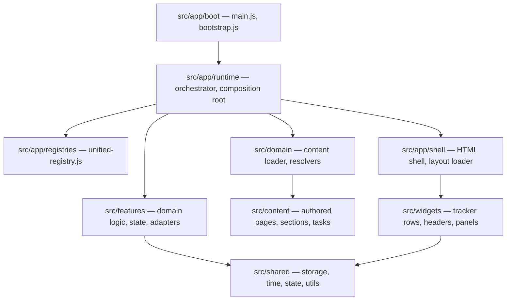
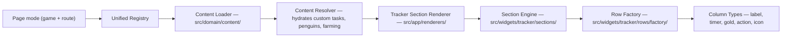

# Dailyscape Architecture Authority Map

## Table of Contents

1. [Top-Level Ownership](#top-level-ownership)
2. [Boundary Rules](#boundary-rules)
3. [Import Direction Rules](#import-direction-rules)
4. [Runtime Flow](#runtime-flow)
5. [Tracker Rendering Flow](#tracker-rendering-flow)
6. [Notes](#notes)

---

## Top-Level Ownership

| Path | Owns |
|---|---|
| `assets/` | Static images, icons, and public assets served by Vite. |
| `docs/` | Active architecture and reference documentation for the current repo state. |
| `src/app/` | Boot flow, runtime orchestration, composition, registries, shell, and top-level renderers. |
| `src/content/` | Authored tracker pages, sections, task/timer content, and JSON schemas. SSoT for all game data. |
| `src/domain/` | Business rules and content resolution logic — loads and validates `src/content/` for runtime. |
| `src/features/` | Feature-specific domain logic, state management, adapters, config sources, and controllers. |
| `src/shared/` | Cross-cutting infrastructure — storage, migrations, time utilities, state, UI primitives, DOM helpers. |
| `src/theme/` | Token-driven CSS architecture. No JS. Loaded exclusively via `<link>` tags in the HTML shell. |
| `src/widgets/` | Self-contained UI components — tracker rows, sections, headers, panels, modals. |
| `tests/` | Node unit tests and Playwright E2E coverage. |
| `tools/` | Audit and content verification scripts. |

---

## Boundary Rules

1. **CSS lives in `src/theme/`** — no inline styles or component-scoped CSS in JS.
2. **Authored content belongs in `src/content/`** — never written by runtime code.
3. **Cross-cutting utilities belong in `src/shared/`** — storage, time, state, DOM helpers.
4. **Feature-specific domain behavior belongs in `src/features/`** — never in `src/app/` or `src/widgets/`.
5. **UI components belong in `src/widgets/`** — they receive data via injection, never import from `src/features/` directly.
6. **`src/app/` is the only layer allowed to import from everything** — it wires all layers together.
7. **`src/content/` imports nothing** — it is pure authored data with zero runtime dependencies.
8. Generated output and temporary artifacts do not belong in the repo state.
9. Documentation must describe the current implementation, not prior planning phases.

---

## Import Direction Rules

```
src/content/   (no imports — pure authored data)
       ↑
src/domain/    (imports from: content, shared)
       ↑
src/features/  (imports from: domain, shared)
       ↑                        ↑
src/widgets/   (imports from: shared — receives features via injection)
       ↑
src/app/       (imports from: everything — the orchestration hub)

src/shared/    (imported by: domain, features, widgets, app)
src/theme/     (loaded via HTML <link> tags only — no JS imports)
```

---

## Runtime Flow



---

## Tracker Rendering Flow



---

## Notes

- `src/content/` is the active authored hierarchy. All task authorship starts here.
- Feature behaviors are driven by logic in `src/features/` but all content definitions reside in `src/content/`.
- Compatibility fields such as `legacyMode` and `legacySectionId` exist to support storage migration and old saved state, not as permission to restore old architecture.
- `src/theme/` is entirely decoupled from JS — it cannot be imported. It is linked from `src/app/shell/html/index.html` at page load.
- The `src/shared/ui/` sublayer contains DOM helpers (`controls.js`, `panel-controls.js`) and UI primitives (tooltip engine). These are utility functions, not components — actual UI components live in `src/widgets/`.
