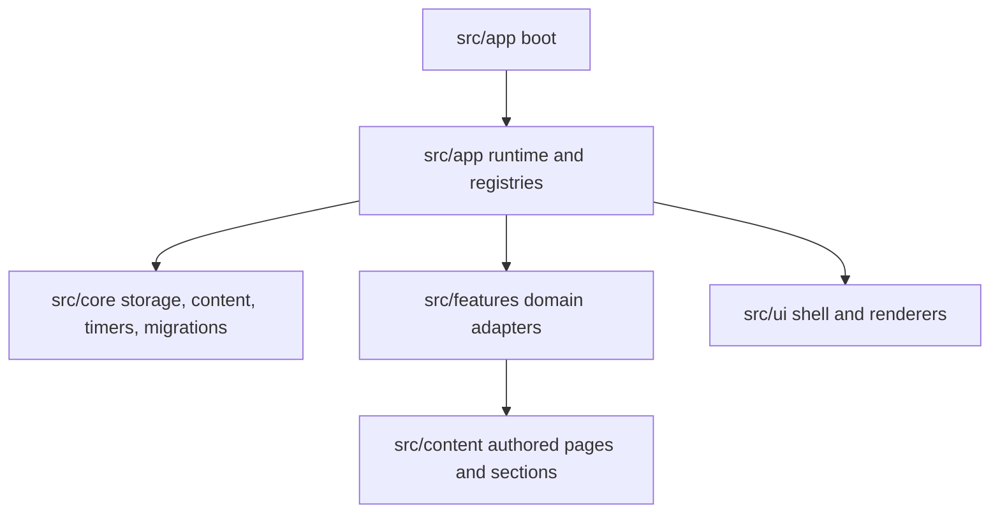
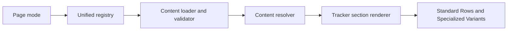

# RSDailies Architecture Authority Map

This document defines the active ownership rules for the current codebase.

## Top-Level Ownership

| Path | Owns |
|---|---|
| `assets/` | Static images and public assets served by Vite. |
| `docs/` | Active architecture and reference documentation for the current repo state. |
| `src/app/` | Boot flow, runtime orchestration, composition, registries, and scheduling. |
| `src/content/` | Authored tracker pages, sections, task/timer content, and JSON schemas. |
| `src/core/` | Shared storage, state, migrations, timers, content resolution, DOM helpers, utilities, and API wrappers. |
| `src/features/` | Feature-specific domain logic, adapters, config sources, and controllers. |
| `src/ui/` | Shell HTML, page glue, components, primitives, and styles. |
| `tests/` | Node unit tests and Playwright smoke coverage. |
| `tools/` | Audit and verification scripts. |

## Boundary Rules

1. Rendered UI belongs in `src/ui/`.
2. Canonical authored tracker structure belongs in `src/content/`.
3. Shared non-visual infrastructure belongs in `src/core/`.
4. Feature-specific domain behavior belongs in `src/features/`.
5. Generated output and temporary artifacts do not belong in the repo state.
6. Removed legacy or compatibility paths should not be reintroduced without an explicit migration plan.
7. Documentation must describe the current implementation, not prior planning phases.

## Runtime Flow

## Tracker Rendering Flow

## Notes

- `src/content/` is the active authored hierarchy for tracker pages and sections.
- Feature behaviors are driven by logic in `src/features/` but all content definitions reside in `src/content/`.
- Compatibility fields such as `legacyMode` and `legacySectionId` exist to support storage migration and old saved state, not as permission to restore old architecture.

